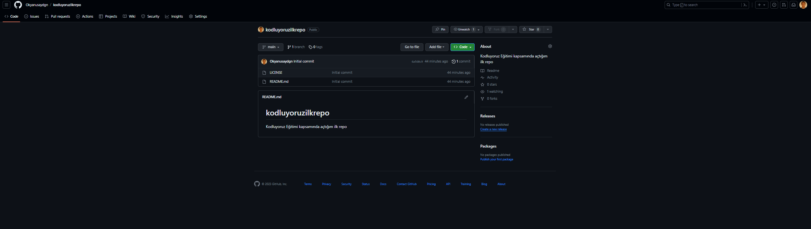

# kodluyoruzilkrepo
Bu repo __[Kodluyoruz](https://www.kodluyoruz.org/)__ Front-End Eğitiminde oluşturduğumuz ilk repo. İçerisinde bir adet
README dosyası, bir adet de index.html barındırıyor.

## Installation

Öncelikle projeyi clonelayın. (Buraya sizin reponuzdan aldığınız link gelecek)

``` 
https://github.com/Okyanusaydgn/kodluyoruzilkrepo.git 
```
<br>

    

## Usage

Projeyi cloneladıktan sonra Visual Studio Code programında açınız.

Linux için:

``` 
cd kodluyoruzilkrepo
code .
```

## Contributing

Pull requestler kabul edilir. Büyük değişiklikler için, lütfen önce neyi değiştirmek <br>
istediğinizi tartışmak için bir konu açınız.

## Licence

[MIT](https://mit-license.org)

<br>


